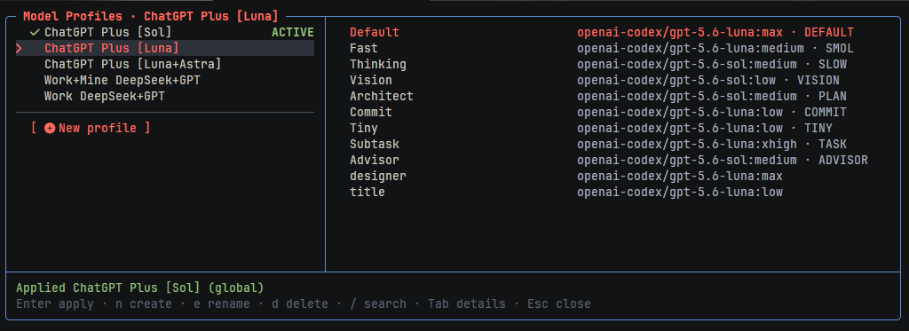

# OMP Model Profiles

An [Oh My Pi](https://github.com/can1357/oh-my-pi) extension for saving and switching complete sets of model-role assignments from a terminal UI.



## Features

- Save the current model-role assignments as a named profile.
- Apply a complete profile in one action.
- Edit individual role assignments with OMP's model browser.
- Rename, search, and delete profiles.
- Support built-in and custom OMP roles without maintaining a fixed role list.
- Respect OMP's global or project model-role storage mode.
- Detect concurrent profile-file changes instead of overwriting them.

## Requirements

- Oh My Pi 18.1.11 or newer

## Installation

Install the extension directly from GitHub:

```sh
omp plugin install github:MRGRD56/omp-model-profiles
```

Reload plugins in an active OMP session:

```text
/reload-plugins
```

Alternatively, restart OMP. Confirm the extension is enabled with:

```sh
omp plugin list --json
```

## Usage

Open the interface with:

```text
/profiles
```

The default shortcut is `Ctrl+Alt+P`.

| Key | Action |
| --- | --- |
| `↑` / `↓` | Select a profile or role |
| `Enter` | Apply a profile or choose a model |
| `Tab` or `←` / `→` | Switch between profiles and role details |
| `n` | Create a profile from the current assignments |
| `e` | Rename the selected profile |
| `d` | Delete the selected profile |
| `/` | Search profiles |
| `Delete` | Set the selected role to Auto while choosing a model |
| `Esc` | Go back or close the interface |

To change the shortcut, add this setting to the active OMP `config.yml`:

```yaml
modelProfilesExtension:
  keybindings:
    openProfiles: ctrl+alt+p
```

Profiles are stored in `model-profiles.yml` inside the active OMP agent directory. The file follows the active OMP profile and honors XDG and `PI_CODING_AGENT_DIR` configuration.
